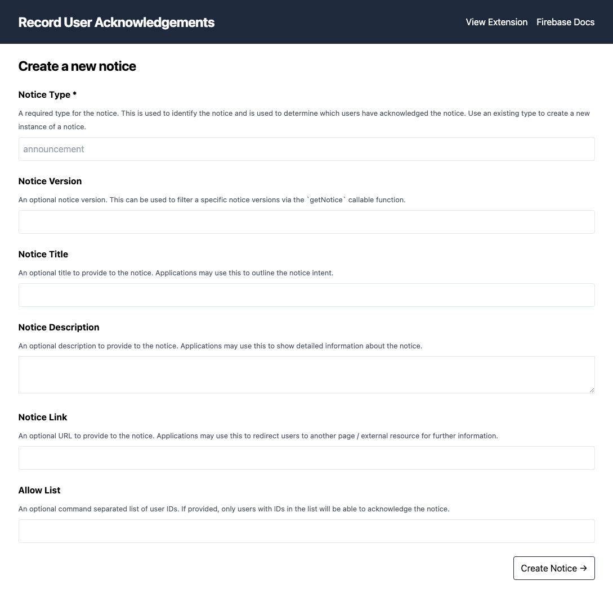

# Usage

The extension stores notices and acknowledgements as documents in a collection inside Firestore. You configure the collection during the installation process, when you set up the extension instance’s configuration parameters.

The extensions' source code contains a [web app providing admin utilities](admin-dashboard) that you can run locally. This contains a notice builder UI that you can use to easily create and customize notices. Setup instructions are available in the above link provided. Once set up, navigate to [localhost:3000](http://localhost:3000) to see the notice builder tool.



## Retrieving a notice

After creating a notice, you can use the following snippet in your web/mobile app to get the notice you want to show to your users, using the notice `type`:

```js
import { getFunctions, httpsCallable } from "firebase/functions";

const functions = getFunctions();
const notice = await httpsCallable(functions, 'ext-firestore-record-user-acknowledgements-getNotice')({
  type: 'banner',
});
```

Note: if multiple instances of this extension are installed the callable function name might contain a unique identifier, e.g. `ext-firestore-record-user-acknowledgements-<id>-getNotice`.

The response of the function call will contain the notice document data, along with whether the current authenticated user has acknowledged the notice.

To retrieve a notice by a specific version, provide the `version` parameter:

```js
import { getFunctions, httpsCallable } from "firebase/functions";

const functions = getFunctions();
const notice = await httpsCallable(functions, 'ext-firestore-record-user-acknowledgements-getNotice')({
  type: 'banner',
  version: 2,
});
```

View the [reference API](REFERENCE.md) for full details on the response interface.

## Acknowledging a notice

To acknowledge a notice, the extension provides two callable functions which accept the notice ID: `acknowledgeNotice` & `unacknowledgeNotice`. The extension will keep historical records of each acknowledgement the callable functions are called multiple times for the same user and notice.

For example, to acknowledge a notice:

```js
import { getFunctions, httpsCallable } from "firebase/functions";

const functions = getFunctions();
await httpsCallable(functions, 'ext-firestore-record-user-acknowledgements-acknowledgeNotice)({
  noticeId: 'EA9QhZKKta9KXcckiasc',
});
```

In-case you need to capture custom preferences relating to a acknowledgement, you can provide custom metadata to the function, for example:

```js
await httpsCallable(functions, 'ext-firestore-record-user-acknowledgements-acknowledgeNotice)({
  noticeId: 'EA9QhZKKta9KXcckiasc',
  metadata: { preference1: true, preference2: false },
});
```

You can also provide a custom “type” of acknowledgement (the default type is “seen”), for example:

```js
await httpsCallable(functions, 'ext-firestore-record-user-acknowledgements-acknowledgeNotice)({
  noticeId: 'EA9QhZKKta9KXcckiasc',
  type: 'seen',
});
```

If you wish to unacknowledge a notice, call the `unacknowledgeNotice` function:

```js
await httpsCallable(functions, 'ext-firestore-record-user-acknowledgements-unacknowledgeNotice)({
  noticeId: 'EA9QhZKKta9KXcckiasc',
  metadata: { reason: '...' },
});
```

## Retrieving acknowledgements

To retrieve all previous user notice acknowledgements, call the `getAcknowledgements` callable function. This function will return an ordered array of all acknowledgements along with the notice data:

```js
import { getFunctions, httpsCallable } from "firebase/functions";

const functions = getFunctions();
const acknowledgements  = await httpsCallable(functions, 'ext-firestore-record-user-acknowledgements-getAcknowledgements)();
```

By default this won’t include unacknowledgement documents, however if those are required you can provide a `includeUnacknowledgements` property to the call:

```js
import { getFunctions, httpsCallable } from "firebase/functions";

const functions = getFunctions();
const acknowledgements  = await httpsCallable(functions, 'ext-firestore-record-user-acknowledgements-getAcknowledgements)({
  includeUnacknowledgements: true,
});
```

## User specific acknowledgements

You may need to create custom notices that are shown to and can only be acknowledged by a specific subset of users. To accomplish this, specify an `allowList` array of UIDs to the notice document. If the user requesting a notice by type is not within the list of UIDs, a `not-found` error will be returned.

## Updating a notice

When it’s time to update a notice, for example when additional user preferences are required, create a new notice document with the same `type` as the existing notice you wish to update.

When the notice is retrieved, a new notice document will be returned with no user acknowledgement, allowing users to acknowledge the newer notice.


